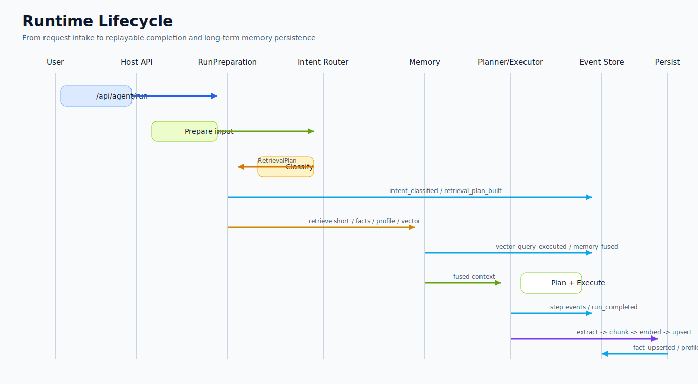
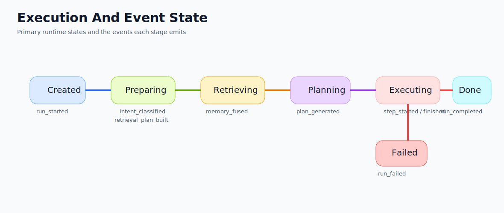

# Runtime Lifecycle

- Status: Active SSOT
- Owner: Ben + Codex
- Last Updated: 2026-03-31
- Related:
  - [System Overview](./system-overview.md)
  - [Memory & Retrieval](../03-modules/memory-retrieval.md)
  - [Observability & Replay](../03-modules/observability-replay.md)
  - Diagram source: [runtime-lifecycle.mmd](../diagrams/runtime-lifecycle.mmd)
  - Diagram source: [execution-event-state.mmd](../diagrams/execution-event-state.mmd)

## 文档目的

这份文档面向 Runtime 的实现和维护者。它说明一次请求从进入 API 到完成回放和长期沉淀的完整生命周期。

## Runtime 生命周期时序图

阅读方式：按从左到右的参与者列看调用关系，按从上到下看一次 run 的时间顺序。

## 执行与事件状态图

阅读方式：先看主状态流，再看每个状态上产出的关键事件。

## 请求主链路

### 1. API 接入

- `/api/agent/run` 处理标准请求 / 响应。
- `/api/agentstream/run` 处理流式事件输出。
- 后续语音入口将复用相同 Runtime，只在输入输出层扩展 STT / TTS。

### 2. RunPreparation

- 组装基础上下文、Persona、Conversation 状态。
- 调用 Intent Router 识别多意图。
- 生成 RetrievalPlan，包括 routes、budgets、topK、rewrite、needClarification、safetyPolicy。
- 记录 `intent_classified`、`retrieval_plan_built`、`model_selected` 等事件。

### 3. Memory Retrieval

- 按 RetrievalPlan 选择 short / working / facts / profile / vector。
- QueryRewriter 负责把原始用户表达重写成更可检索的查询。
- RetrievalFusion 负责预算控制、去重、冲突处理和摘要生成。
- 记录 `vector_query_executed`、`memory_retrieved_long_term`、`memory_fused`。

### 4. Planner

- 使用已增强的 planner input 生成 AgentPlan。
- Planner 只负责动作序列与工具选择，不直接决定底层记忆怎么召回。

### 5. Executor

- 顺序执行 steps。
- 调用内置 tool、后续的 MCP tool、以及可能的子 agent。
- 发生失败时保留足够上下文，供 Reviewer / Repair Plan 处理。

### 6. Reflection / Reviewer

- Reflection 用于总结、学习、收尾。
- Reviewer 未来负责判定是否需要 `repair_plan` 而不是简单 retry。

### 7. Completion & Persist

- run 完成后提取事实、更新 profile、分块、嵌入、向量入库。
- 记录 `fact_upserted`、`fact_conflict`、`profile_updated`、`profile_update_skipped`、`vector_upserted`。

### 8. Replay & Audit

- Event Store 提供完整 run 事件序列。
- UI 与调试工具依赖事件还原 Prompt、Plan、Step、Tool 与结果。

## Week7 之后的关键变化

### Intent Router 与 Planner 的边界

- Intent Router 决定“需要哪些信息与风险控制”。
- Planner 决定“执行哪些步骤与工具”。
- 两者都产出事件，因而都可解释、可回放。

### 多意图策略

- 同一句话允许输出多个 intent，例如：`chitchat + recall + tool_needed`。
- 显式任务优先，但表达风格保留 Persona 和闲聊语气。

### Health-sensitive 策略

- 命中 health-sensitive intent 时，强制召回禁忌 facts。
- 注入免责声明和安全策略事件 `safety_policy_applied`。

## 状态边界

- 未开始：Run 已创建但尚未进入准备阶段。
- 准备中：Intent、Memory、Prompt 等输入正在成型。
- 执行中：Plan 已生成，steps 正在运行。
- 反思中：执行后总结、纠错、后置更新。
- 已完成：输出与事件稳定落库，可回放。
- 已失败：保留失败事件与上下文，供后续人工或 repair plan 分析。

## 实施约束

- 所有关键决策都必须落事件，不允许“暗箱逻辑”。
- 任何新增能力应优先挂接到现有 Runtime 生命周期，而不是旁路接入。
- 文档、代码、事件命名要一致，避免同义不同名。
