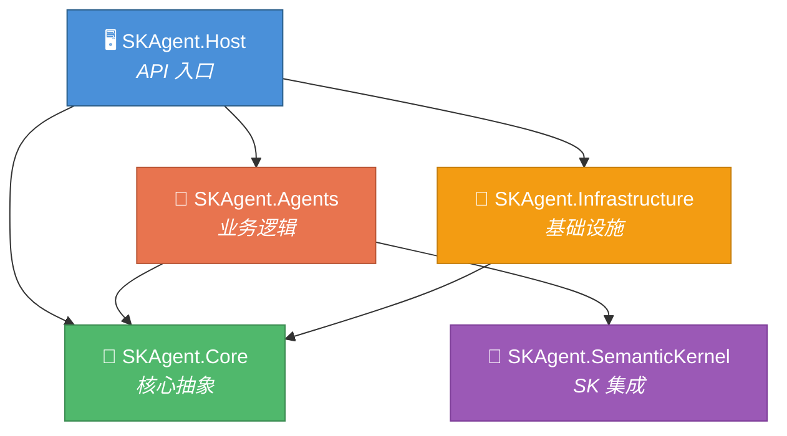
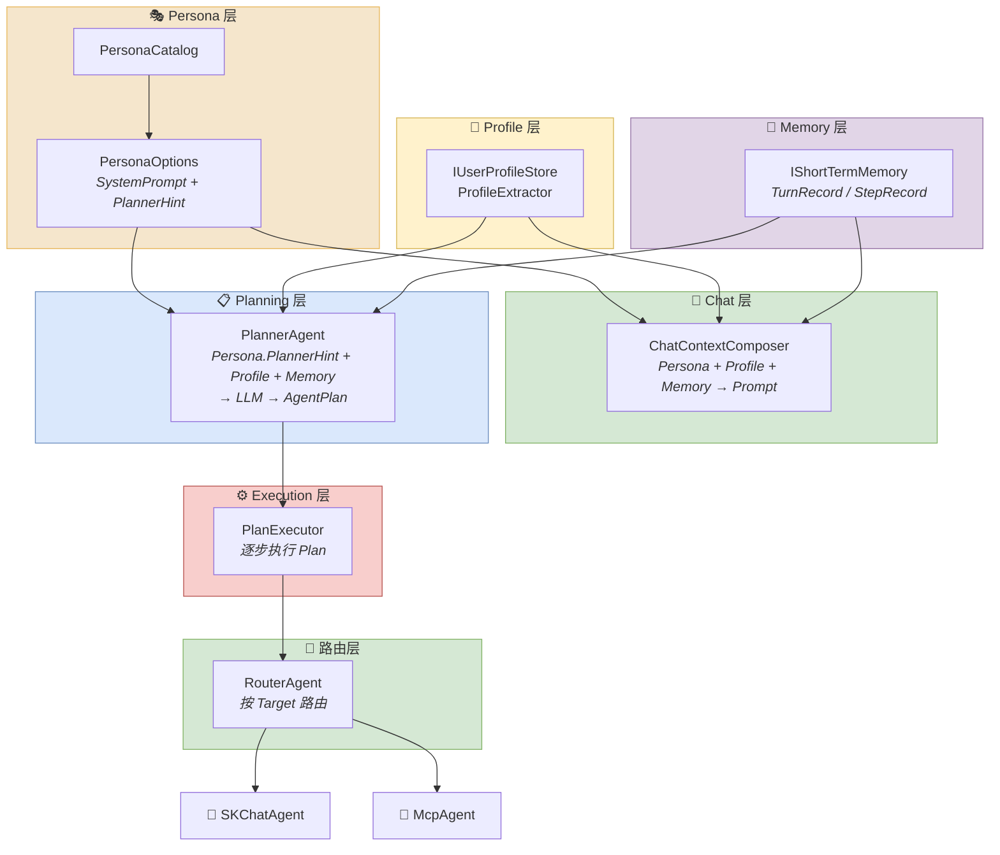
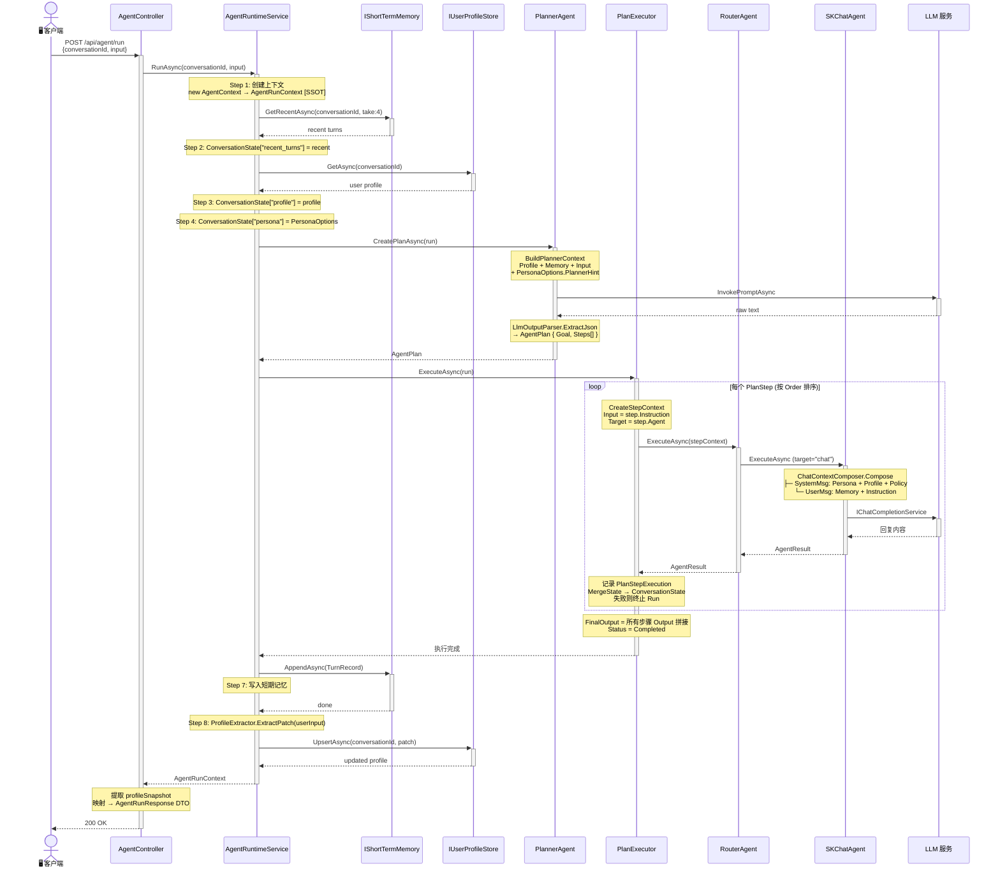
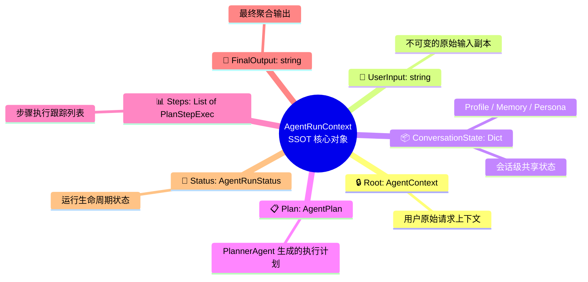

# SkAgentSolution 解决方案架构与调用流程

## 一、解决方案总览

```
SkAgentSolution/
├── Docs/                          # 文档目录
├── Src/
│   ├── SKAgent.Core/              # 核心抽象层（接口 & 协议定义）
│   ├── SKAgent.Agents/            # Agent 业务逻辑层（核心实现）
│   ├── SKAgent.SemanticKernel/    # Semantic Kernel 集成层
│   ├── SKAgent.Infrastructure/    # 基础设施层（外部服务实现）
│   └── SKAgent.Host/             # API 宿主层（ASP.NET Core Web API）
```

### 项目依赖关系



---

## 二、各项目职责说明

### 1. SKAgent.Core — 核心抽象层

定义系统中最基础的接口和模型，**不包含任何业务逻辑和第三方依赖**。

| 文件夹 / 文件 | 职责 |
|---|---|
| `Agent/IAgent.cs` | Agent 统一接口，定义 `Name` 和 `ExecuteAsync` |
| `Agent/AgentContext.cs` | Agent 执行上下文，承载输入、路由目标、共享状态 |
| `Agent/AgentResult.cs` | Agent 统一输出结果 |
| `Tools/IAgentTool.cs` | Agent 工具接口（预留，当前未使用） |
| `Protocols/A2A/` | Agent-to-Agent 通信协议（预留） |
| `Protocols/MCP/` | Model Context Protocol 协议接口 |
| `Utilities/LlmOutputParser.cs` | LLM 输出解析工具（从原始文本提取 JSON） |

### 2. SKAgent.Agents — Agent 业务逻辑层

**核心实现层**，包含所有 Agent、运行时编排、记忆、画像、人格等功能模块。

#### 文件夹分层说明

| 文件夹 | 层级含义 | 职责 |
|---|---|---|
| `Persona/` | **人格层** | 系统级人格约束。PersonaOptions 定义人格配置（SystemPrompt + PlannerHint），PersonaCatalog 提供预设人格目录。影响 ChatAgent 的回复风格和 Planner 的计划拆解策略。 |
| `Profile/` | **画像层** | 用户级画像管理。比短期记忆更稳定的用户信息（姓名、地点、作息等）。IUserProfileStore 定义存储接口，ProfileExtractor 从用户输入中提取画像字段。画像数据跨会话持久化，用于个性化回复。 |
| `Memory/` | **记忆层** | 会话级短期记忆。IShortTermMemory 定义存储接口，TurnRecord/StepRecord 是记忆数据模型。每次对话回合结束后写入，下次请求时加载最近 N 轮供上下文参考。 |
| `Chat/` | **对话构建层** | 对话上下文组合。将 Persona（人格）、Profile（画像）、Memory（记忆）三要素组合为 LLM 可理解的 ChatContext（SystemMessage + UserMessage）。是 Persona/Profile/Memory 到 LLM 的桥梁。 |
| `Planning/` | **规划层** | LLM 驱动的计划生成。PlannerAgent 调用 LLM 将用户请求拆解为有序的 AgentPlan（目标 + 步骤列表）。每个 PlanStep 指定由哪个 Agent 执行什么指令。 |
| `Execution/` | **执行层** | 计划执行引擎。PlanExecutor 按顺序执行 AgentPlan 中的每个步骤，为每步创建独立 StepContext，通过 RouterAgent 路由到目标 Agent，并管理状态合并和失败处理。 |
| `Runtime/` | **运行时层** | 总编排服务。AgentRuntimeService 串联所有环节（加载上下文 → 规划 → 执行 → 记忆写入 → 画像更新），AgentRunContext 是整个 Run 的 SSOT（单一真实数据源）。 |

#### 根目录 Agent 文件

| 文件 | 状态 | 职责 |
|---|---|---|
| `SKChatAgent.cs` | ✅ 活跃 | Semantic Kernel Chat Agent，基于 LLM 的对话回复引擎（agent="chat"） |
| `McpAgent.cs` | ✅ 活跃 | MCP 协议 Agent，调用外部工具/系统（agent="mcp"） |
| `RouterAgent.cs` | ✅ 活跃 | 路由 Agent，根据 Target 名称分发请求到目标 Agent |
| `OrchestratorAgent.cs` | ⚠️ 已废弃 | 早期编排 Agent，已被 RuntimeService + PlanExecutor 替代 |
| `HealthAgent.cs` | 🔲 占位 | 预留健康/养生 Agent |
| `AssistantAgent.cs` | 🔲 占位 | 预留通用助手 Agent |
| `CodingAgent.cs` | 🔲 占位 | 预留编程 Agent |

### 3. SKAgent.SemanticKernel — Semantic Kernel 集成层

封装 Semantic Kernel 的创建和配置逻辑。

| 文件 | 职责 |
|---|---|
| `KernelFactory.cs` | 从 IConfiguration 读取 OpenAI 配置，构建 Kernel 实例 |
| `Plugins/TimePlugin.cs` | 预留时间插件占位 |

### 4. SKAgent.Infrastructure — 基础设施层

提供 Core 层接口的具体实现（外部服务交互）。

| 文件 | 职责 |
|---|---|
| `Mcp/McpClient.cs` | IMcpClient 的模拟实现（当前为 stub） |
| `A2A/LocalA2AChannel.cs` | IA2AChannel 的本地模拟实现 |
| `Llm/OpenAIProvider.cs` | 预留 OpenAI 提供者占位（已由 SK 替代） |

### 5. SKAgent.Host — API 宿主层

ASP.NET Core Web API 宿主，提供 HTTP 入口和 DI 配置。

| 文件 | 职责 |
|---|---|
| `Program.cs` | 应用入口，配置服务和中间件管道 |
| `DependencyInjection.cs` | 集中注册所有 SKAgent 服务到 DI 容器 |
| `Controllers/AgentController.cs` | API 控制器，暴露 `/api/agent/run` 端点 |
| `Contracts/AgentRunRequest.cs` | 请求 DTO：`{ conversationId?, input }` |
| `Contracts/AgentRunResponse.cs` | 响应 DTO：`{ conversationId, runId, output, steps, profileSnapshot }` |

---

## 三、核心数据流转架构图



---

## 四、`POST /api/agent/run` 完整调用流程图



**响应示例：**

```json
{
  "conversationId": "abc123",
  "runId": "...",
  "goal": "回应用户的自我介绍",
  "status": "Completed",
  "output": "你好笨笨！很高兴认识你...",
  "profileSnapshot": { "name": "笨笨" },
  "steps": [
    { "order": 1, "agent": "chat", "status": "Success", "output": "..." }
  ]
}

---

## 五、SSOT（Single Source of Truth）设计原则



**关键设计**：
- **Root 只保存用户原始输入**，不会被 Step 修改。
- **每个 Step 使用独立 StepContext**：Input = PlanStep.Instruction，State 从 ConversationState 复制。
- **ConversationState 是 Step 间共享数据的唯一桥梁**：步骤执行后通过 MergeState 回写。
- **UserInput 永远不变**，用于记忆写入、画像提取和审计。

---

## 六、DI 注册概览

```csharp
// DependencyInjection.AddSkAgentServices 注册顺序：

// ① Semantic Kernel
Singleton: Kernel                   ← KernelFactory.Create(config)

// ② 基础设施
Singleton: IMcpClient               ← McpClient (模拟实现)

// ③ Agent 实例
Singleton: SKChatAgent              (agent="chat")
Singleton: McpAgent                 (agent="mcp")
Singleton: IAgent → SKChatAgent     (RouterAgent 枚举用)
Singleton: IAgent → McpAgent        (RouterAgent 枚举用)

// ④ 路由/规划/执行
Singleton: RouterAgent              (名称匹配路由)
Singleton: PlannerAgent             (LLM 计划生成)
Singleton: PlanExecutor             (计划执行引擎)

// ⑤ 记忆/画像/人格
Singleton: IShortTermMemory         ← InMemoryShortTermMemory(max:20)
Singleton: IUserProfileStore        ← InMemoryUserProfileStore
Singleton: PersonaOptions           ← PersonaCatalog.EngineerTCM
Singleton: IChatContextComposer     ← DefaultChatContextComposer

// ⑥ 运行时服务
Scoped:    AgentRuntimeService      (每次请求独立实例)
```

---

## 七、配置文件说明

### appsettings.json

```json
{
  "OpenAI": {
    "ChatModelId": "hunyuan-turbos-latest",  // LLM 模型 ID
    "ApiKey": "sk-xxx",                       // API 密钥
    "BaseUrl": "https://api.hunyuan.cloud.tencent.com/v1"  // 兼容 OpenAI API 的服务地址
  }
}
```

### launchSettings.json

```json
{
  "profiles": {
    "http":  { "applicationUrl": "http://localhost:5192" },
    "https": { "applicationUrl": "https://localhost:7108;http://localhost:5192" }
  }
}
```

---

## 八、Week 演进路线

| Week | 主要交付 | 关键组件 |
|------|---------|---------|
| Week 2 | 基础 Agent 路由 | IAgent, RouterAgent, OrchestratorAgent(已废弃) |
| Week 3 | SSOT + Trace + ShortTermMemory | AgentRunContext, PlannerAgent, PlanExecutor, IShortTermMemory |
| **Week 4** | **最小陪伴体（Persona + Profile + 会话级 API）** | **PersonaOptions, IUserProfileStore, ProfileExtractor, ChatContextComposer, DTO 化 API** |
| Week 5+ | 计划中... | Prompt budget 优化、LLM 版 ProfileExtractor、反思机制 等 |
