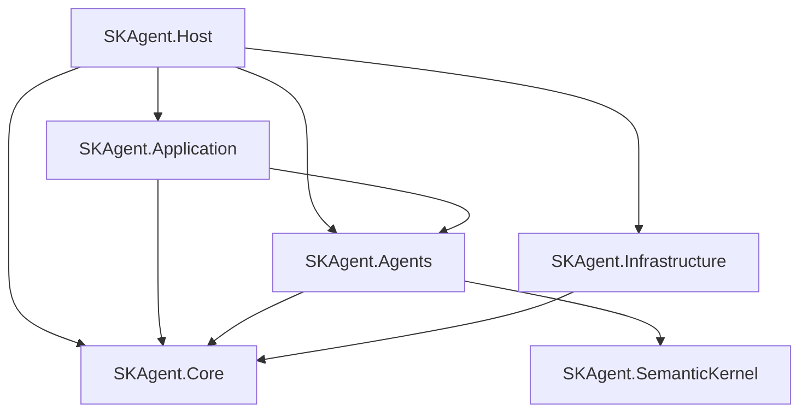
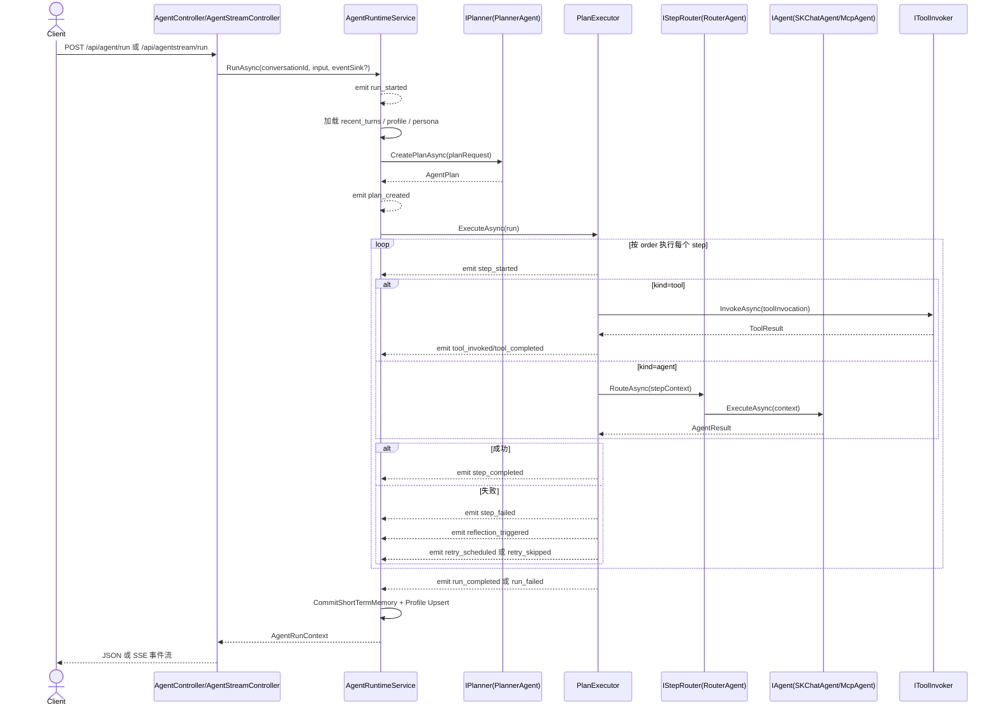

# SkAgentSolution 解决方案架构与调用流程

> 本文档已按重构后的项目结构更新（含 `SKAgent.Application` 应用层）。

## 一、解决方案结构（当前）

```text
SkAgentSolution/
├── Docs/
├── SKAgent.Application/           # 应用层（运行时编排、执行、反思、工具调用）
└── Src/
    ├── SKAgent.Core/              # 核心抽象与协议
    ├── SKAgent.Agents/            # 具体 Agent 实现（chat/mcp/router/planner）
    ├── SKAgent.SemanticKernel/    # Semantic Kernel 集成
    ├── SKAgent.Infrastructure/    # 外部依赖实现（MCP/Profile/SSE 等）
    └── SKAgent.Host/              # API 宿主（控制器 + DI + 启动）
```

## 二、分层职责与依赖


```mermaid
graph TD
    Host[SKAgent.Host]
    App[SKAgent.Application]
    Agents[SKAgent.Agents]
    Core[SKAgent.Core]
    Infra[SKAgent.Infrastructure]
    SK[SKAgent.SemanticKernel]

    Host --> App
    Host --> Agents
    Host --> Infra
    Host --> Core

    App --> Core
    App --> Agents

    Agents --> Core
    Agents --> SK

    Infra --> Core
```

### 职责摘要

- `SKAgent.Core`
  - 抽象与模型：`IAgent`、`IPlanner`、`IStepRouter`、`ITool*`、`RunEvent`、Plan/Step。
- `SKAgent.Application`
  - 业务用例编排：`AgentRuntimeService`、`PlanExecutor`、Reflection、ToolInvoker。
- `SKAgent.Agents`
  - Agent 能力实现：`SKChatAgent`、`McpAgent`、`RouterAgent`、`PlannerAgent`。
- `SKAgent.Infrastructure`
  - 适配器实现：`McpClient`、`InMemoryUserProfileStore`、`SseRunEventSink` 等。
- `SKAgent.SemanticKernel`
  - `KernelFactory` 与插件注册。
- `SKAgent.Host`
  - 控制器入口、DI 组装、中间件管道。

## 三、HTTP 入口（当前）

- 非流式：`POST /api/agent/run`
  - 控制器：`AgentController`
  - 返回：`AgentRunResponse`

- 流式（SSE）：`POST /api/agentstream/run`
  - 控制器：`AgentStreamController`
  - 行为：将 `SseRunEventSink` 注入 `RunAsync`，实时推送事件流

## 四、核心调用流程


```mermaid
sequenceDiagram
    actor Client as Client
    participant Ctrl as AgentController/AgentStreamController
    participant Runtime as AgentRuntimeService
    participant Planner as IPlanner(PlannerAgent)
    participant Exec as PlanExecutor
    participant Router as IStepRouter(RouterAgent)
    participant Agent as IAgent(SKChatAgent/McpAgent)
    participant Tool as IToolInvoker

    Client->>Ctrl: POST /api/agent/run 或 /api/agentstream/run
    Ctrl->>Runtime: RunAsync(conversationId, input, eventSink?)

    Runtime-->>Runtime: emit run_started
    Runtime->>Runtime: 加载 recent_turns / profile / persona

    Runtime->>Planner: CreatePlanAsync(planRequest)
    Planner-->>Runtime: AgentPlan
    Runtime-->>Runtime: emit plan_created

    Runtime->>Exec: ExecuteAsync(run)

    loop 按 order 执行每个 step
        Exec-->>Runtime: emit step_started
        alt kind=tool
            Exec->>Tool: InvokeAsync(toolInvocation)
            Tool-->>Exec: ToolResult
            Exec-->>Runtime: emit tool_invoked/tool_completed
        else kind=agent
            Exec->>Router: RouteAsync(stepContext)
            Router->>Agent: ExecuteAsync(context)
            Agent-->>Exec: AgentResult
        end

        alt 成功
            Exec-->>Runtime: emit step_completed
        else 失败
            Exec-->>Runtime: emit step_failed
            Exec-->>Runtime: emit reflection_triggered
            Exec-->>Runtime: emit retry_scheduled 或 retry_skipped
        end
    end

    Exec-->>Runtime: emit run_completed 或 run_failed
    Runtime->>Runtime: CommitShortTermMemory + Profile Upsert
    Runtime-->>Ctrl: AgentRunContext
    Ctrl-->>Client: JSON 或 SSE 事件流
```

## 五、SSOT 说明

运行时单一事实来源为 `AgentRunContext`，关键字段包括：

- 标识：`RunId`、`ConversationId`
- 输入：`UserInput`、`Root`
- 计划：`Plan`
- 执行轨迹：`Steps`、`ToolCalls`、`StepRetryCounts`
- 共享状态：`ConversationState`
- 事件：`EventSeq`、`EventSink`
- 结果：`Status`、`FinalOutput`

这保证了非流式响应、SSE 事件、调试排障都基于同一份运行事实。
